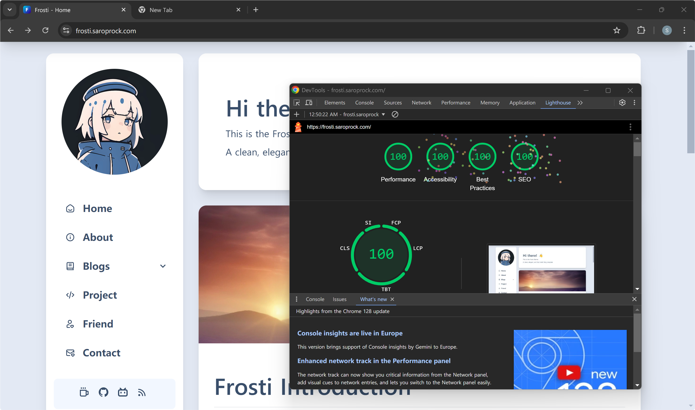

# 🧊 Frosti

[](https://github.com/EveSunMaple/Frosti/blob/main/LICENSE)&nbsp;&nbsp;&nbsp;[](https://github.com/EveSunMaple/Frosti/releases)&nbsp;&nbsp;&nbsp;[](https://stackblitz.com/github/EveSunMaple/Frosti)

<pre align="center">
一个简洁、优雅、快速的静态博客模板！🚀 使用 Astro 开发
</pre>

[**🖥️ Frosti Demo**](https://frosti.saroprock.com)&nbsp;&nbsp;&nbsp;/&nbsp;&nbsp;&nbsp;[**🌏 中文 README**](https://github.com/Aurora-Yinph/Frosti/blob/main/docs/README.zh-CN.md)&nbsp;&nbsp;&nbsp;/&nbsp;&nbsp;&nbsp;[**❤️My Blog**](https://yinph.netlify.app/)

> [!TIP]
> 推荐先查看此主题的预览

## 🖥️ 预览


## ⏲️ 性能



## ✨ 特点

- ✅ 极速的访问速度与优秀的 SEO
- ✅ 视图过渡动画（使用 Swup）
- ✅ 你可以搜索你的文章（使用 pagefind）
- ✅ **白天** / **黑夜** 模式可用
- ✅ 使用 [Waline](https://waline.js.org/) 搭建的评论系统
- ✅ 使用 [Tailwind CSS](https://tailwindcss.com/) 与 [daisyUI](https://daisyui.com/) 构建自适应页面
- 🛠️ 博客易上手
  - 安装只需要一行命令
  - 可以在 `consts.ts` 自定义您博客的内容

> [!IMPORTANT]
> 评论系统需自己配置，详见 [Waline](https://waline.js.org/) 更改 `src\components\CommentWaline.astro`

## ✒️ 文章信息

|    名称     |   含义   | 是否必要 |
| :---------: | :------: | :------: |
|    title    | 文章标题 |    是    |
| description | 文章简介 |    是    |
|   pubDate   | 文章日期 |    是    |
|    image    | 文章封面 |    否    |
| categories  | 文章分类 |    否    |
|    tags     | 文章标签 |    否    |
|    badge    | 文章徽标 |    否    |

> [!TIP]
> 您可以通过把 `badge` 属性设置为 `Pin` 来置顶您的文章

## ⬇️ 使用方法

> [!IMPORTANT]
> Frosti 使用pnpm作为包管理器，如果你没有安装pnpm，请先安装pnpm

通过将 `--template` 参数传递给 `create astro` 命令来使用 Frosti ！

```sh
pnpm create astro@latest -- --template EveSunMaple/Frosti
```

<details>
  <summary><h3>出现问题？通过克隆本仓库构建！</h3></summary>

1. 安装pnpm包管理器

```sh
npm i -g pnpm
```

2. 克隆项目

```sh
git clone --depth 1 https://github.com/  EveSunMaple/Frosti.git Frosti
```

3. 进入项目文件夹

```sh
cd Frosti
```

4. 安装依赖

```sh
pnpm i
```

5. 调试、运行项目

```sh
pnpm run dev # 启动调试服务器

pnpm run build # 构建项目为静态文件
```

</details>

> [!NOTE]
> Frosti 默认通过 pnpm build 构建，如果出现报错，请运行 `pnpm update`

> [!TIP]
> 您当然也可以使用其他方式来部署 Frosti，比如 Vercel、Netlify 等。但是您需要掌握这些服务的基本使用方法。
> [Astro支持的deploy方式](https://docs.astro.build/zh-cn/guides/deploy/)

## 🎯 计划

- [ ] 尝试接入无头 cms
- [ ] 修复已知的样式错误
- [ ] 更多……

## 👀 问题

如果你有任何问题或建议，可以通过提交 Issues 来反馈或同开发者交流！

## 🎉 感谢

@[Saicaca](https://github.com/saicaca) 他的启迪是我制作此主题的主要原因

@[WRXinYue](https://github.com/WRXinYue) 在我前期入门时帮助了我很多
